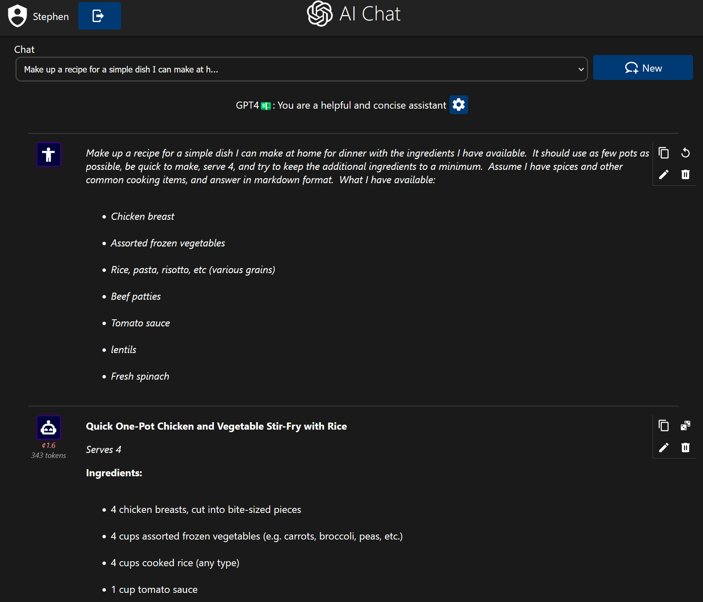

# homelab-gpt

Web interface to chat with GPT 3.5 and 4, designed with a homelab environment in mind.


### Motivation

I created this app because I use OpenAI's API's directly to get help with programming and general questions using GPT4, but find OpenAI's playground cumbersome to use directly.  Others in my household then began finding this app handy so I made the interface simple, aesthetically pleasing, and support multiple users.  You might find it helpful if you want a convenient but powerful way to interact with Open AI's chat models and also have a docker environment set up in your homelab.

### Features

Broadly speaking the webapp provides an interface similar to Open AI's playground, but oriented for daily use:

- Log-in is optional, you can just open the webpage and start.
- Server can be provided an OpenAI API key, which gets used as a default for all requests.
- Maintains a log of previous messages.
- Allows logging in and saving the history of any number of chats.
- Provides feedback of the cost, in USD, of each chat message and a running total for the entire chat.
- Good user/pass authentication using B-First SRP.
- Allows editing the chat log (eg adding, deleting, rewriting, etc).
- Chats are parsed as markdown, and code examples get syntax highlighting for common languages.
- Some chat options can be overidden on a per-chat basis (api key, determinism, system message/prompt, max tokens, etc)
- Website is properly installable as a progressive web app.
- Website is also mobile-friendly.
- Lots of other little quality-of-life features I forgot.

### Caveats

 - This container runs a website that isn't really designed to be exposed to assault from the internet.  If you expsoe it externally, putting it behind your own proxy and authentication that you trust is recommended.
 - If you expose the server to the internet and provide an API key, anyone can open the page and talk to the AI, chanrging your Open AI account.  Protect your webserver.

### Run (docker CLI)

``` bash
docker run -p 80:80 -e OPEN_API_KEY=your_open_api_key_here chatgpt -v .:/data ghcr.io/sabeechen/homelab-gpt:latest
```

Once run the interface will be available on port 80 and an empty database will be initialized in the directory or volume you mounted.  Mounting this directly is only needed if you intend to log in.

### Run (alternative using docker-compose)

```yaml
version: '2.4'

services:
  gpt-chat:
   image: ghcr.io/sabeechen/homelab-gpt
   container_name: gpt-chat
   environment:
      OPENAI_API_KEY: your_openai_api_key
   volumes:
      - "/some/local/directory:/data"

```


### If you want to build the image yourself
```bash
git clone https://github.com/sabeechen/homelab-gpt
cd homelab-gpt
docker build -t chatgpt .
```

### Develop
1. Open the projects' devcontainer in VSCode.  It might take a few minutes to spin up.

2. #### Install node dependencies
   ```bash
   npm i
   ```
3. Store your OpenAI API key in ```.env``` file
   ```bash
   echo "OPENAI_API_KEY=your_api_key_goes_here``` >> .env
   ```
4. #### Build the javascript
   ```bash
   npm run build
   ```
5. Run the "Dev Server" run configuration to start the server side of things.
6. Visit http://localhost:80 to use the website.

Repeat steps 4 through 6 as you change code.

Some notes on developing this:
 - The web interface is written in TypeScript using the LitElement framework
 - The WebServer component is written in python and uses OpenAI's python library.